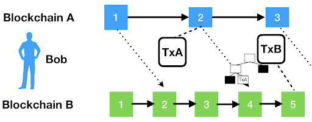

# Crosschain Communication and Blockchain Interoperability

In this section, we're going to discuss about why blockchain networks might want to communicate to each other and how that occurs. We mentioned way back in the "Blockchain Fundamentals: Network Configurations" section about the compatibility of certain blockchains and how they might link together. We're going to spend this lesson discussing this in more detail

## Why?

From <a href="https://twitter.com/drinkcoffee2010" target="_blank" rel="noopener noreferrer">Peter Robinson:</a>

> [T]here is no one blockchain to rule them all. There are public permissionless blockchains such as Ethereum Mainnet, Bitcoin, and Filecoin. There are many instances of permissioned, consortium blockchains such as Enterprise Ethereum / Quorum, Corda and Hyperledger Fabric. Within the public permissionless Ethereum space, Sidechains and Roll-ups (L2s) are emerging to improve scalability. All of these technologies need Crosschain Communications to allow them to communicate. Even if the world settled on one blockchain technology platform, all data and all functionality is unlikely to reside on just one instance of the blockchain platform. 

Crosschain communications allows data (state) and functionality (execution) that resides on one blockchain to be accessible from another blockchain.

The seeds of crosschain communication can be found in the Bitcoin whitepaper. Under the section, "Simplified Payment Verification," Nakamoto writes:

> It is possible to verify payments without running a full network node. A user only needs to keep a copy of the block headers of the longest proof-of-work chain, which he can get by querying network nodes until he's convinced he has the longest chain, and obtain the **Merkle branch linking the transaction to the block it's timestamped in.** He can't check the transaction for himself, but by linking it to a place in the chain, he can see that a network node has accepted it, and blocks added after it further confirm the network has accepted it.

This "light" process proves the validity of a transaction by including the verified (mined) block header hash it appeared in as well as <a href="https://blog.ethereum.org/2015/11/15/merkling-in-ethereum/" target="_blank" rel="noopener noreferrer">the Merkle Proof</a> showing how the individual transaction is included in that hash.

Developers realized they could use this implementation to build something that would validate Bitcoin payments on another chain entirely, and used it to build one of the first blockchain bridges, <a href="https://buildmedia.readthedocs.org/media/pdf/btc-relay/latest/btc-relay.pdf" target="_blank" rel="noopener noreferrer">BTC Relay.</a>

*Simplified Diagram of BTC Relay using transactions mined on Blockchain A to validate action on Blockchain B*

BTC Relay used the Simplified Payment Verification to move Ether from one account to the other using a Bitcoin transaction. Transactions could only be validated if the block header they relate to is on the longest chain and if at least six block headers have been posted on top of the block header that the transaction relates to. As attackers can not produce a longer chain than the main Bitcoin blockchain due to the mining difficulty, they are unable to confirm transactions based on a malicious fork.

Other mechanisms of doing similar crosschain action include <a href="https://en.bitcoin.it/wiki/Hash_Time_Locked_Contracts" target="_blank" rel="noopener noreferrer">Hash Time Locked Contracts.</a>

## How Crosschain Communication

Crosschain Communication and Blockchain Interoperability rely on the concept of Atomicity.

## Examples of Crosschain and Blockchain Interoperability

## Additional Material
- <a href="https://www.youtube.com/watch?v=ZQJWMiX4hT0" target="_blank" rel="noopener noreferrer">Video: Building Bridges, Not Walled Gardens</a> An argument for bridges and crosschain communication from James Prestwich of cLabs.
- 